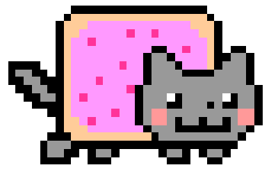

# Software Studio 2023 Spring
## Assignment 01 Web Canvas


### Scoring

| **Basic components**                             | **Score** | **Check** |
| :----------------------------------------------- | :-------: | :-------: |
| Basic control tools                              | 30%       | Y         |
| Text input                                       | 10%       | Y         |
| Cursor icon                                      | 10%       | Y         |
| Refresh button                                   | 5%       | Y         |

| **Advanced tools**                               | **Score** | **Check** |
| :----------------------------------------------- | :-------: | :-------: |
| Different brush shapes                           | 15%       | Y         |
| Un/Re-do button                                  | 10%       | Y         |
| Image tool                                       | 5%        | Y         |
| Download                                         | 5%        | Y         |

| **Other useful widgets**                         | **Score** | **Check** |
| :----------------------------------------------- | :-------: | :-------: |
| Name of widgets                                  | 1~5%     | Y         |


---

### How to use 


The white area on the left represents the canvas. The color box located in the bottom-left corner indicates the currently selected color. The available tools are located on the right-hand side.

### Basic & Advanced Tools

#### Color Picker


Color Picker is generated with 2 loops, red increases from top to bottom, and green increases from left to right. Blue is set to 127 for all pixels. By combining the rgb, we can generate the color picker. You can select the color by clicking on it.

When the mouse hovers over the color picker, the color box will display the color currently being hovered over. However, when the mouse leaves the color picker, the color box will revert to showing the selected color.

#### Brush Width


The brush width is controlled by the slider bar. You can drag the slider button to adjust the brush size for the pencil, eraser, and even shapes.

#### Font Family, Font Size


You can select different font families and font sizes, and display text on the canvas using the text input tool, which will be described later.

#### Pencil


Draw arbitrary shapes on the canvas. The width of the line can be adjusted by the brush width.

#### Eraser


Erase everything touched by the eraser on the canvas. The size of the eraser can also be adjusted by the brush width.

#### Text Input


With this tool, you can display text on the canvas. Click where you want to place the text, then type in the input box.


After pressing the `Enter` key or clicking somewhere else on the canvas, the text will be displayed on the canvas.

#### Line


Draw a straight line on the canvas. The line is a draggable tool, which means it can be moved around by dragging the mouse. However, once the mouse is released, the line cannot be modified. The line width is controlled by the brush width tool.

#### Circle


Draw a circle on the canvas. First, click on the center of the circle. Then, drag the mouse to adjust its radius. Similar to a line, the circle is also a draggable tool. The line width is controlled by the brush width tool.

#### Triangle


Draw a triangle on the canvas. You can draw a reversed triangle by dragging upward. The triangle is also a draggable tool, and its line width is controlled by the brush width tool.

#### Rectangle


Draw a rectangle on the canvas. This is also a draggable tool, and its line width is controlled by the brush width tool.

#### Upload


Upload and resize an image to fill the entire canvas.

#### Download


Download the current canvas as a png file.

#### Undo


Undo the previous action. You can undo several actions by clicking it multiple times. This is implemented using a stack to store user actions. All actions are undoable, including pencil drawings, erasers, text insertions, lines, circles, triangles, rectangles, image uploads, clear operations, and clown stamps (which will be described later).

#### Redo


Redo the next action if possible. Suppose you perform three actions 1, 2, 3 in order, then perform one undo operation.

```
1 2 3
  ^
```

Then, by after performing action 4, action 3 will be removed forever.

```
1 2 4
    ^
```

If you undo the canvas to action 2 and perform one redo operation, the canvas will revert to the state of action 4 instead of action 3.

#### Clear


Clear the entire canvas by the `clearRect` function.

### Other Useful Widgets

#### Yin Yang


You can now draw filled circles, triangles, and rectangles on the canvas! By clicking this button, you can switch mode between "fill" or "no fill" the shapes.

Before clicking the button, the status of the buttons is


After clicking the button, the status of the buttons is


After clicking the button again, the status became "no fill" again.

#### Magic Wand


The magic wand will select a random color for you.

#### Nyan Cat


When turning on "Nyan Cat" mode, colors will automatically change every 5 milliseconds. In "Nyan Cat" mode, the picture on the button will change to a gif.



You can draw lines with rainbow color on the canvas.


To turn the mode off, just click the button again.

#### Clown


Switch to stamp mode. After clicking on the canvas, it will stamp a clown sticker onto it.


### Web page link

    your web page URL.

### Others (Optional)

    Anything you want to say to TAs.

<style>
table th{
    width: 100%;
}
</style>