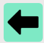
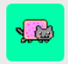

# Software Studio 2023 Spring
## Assignment 01 Web Canvas


### Scoring

| **Basic components**                             | **Score** | **Check** |
| :----------------------------------------------- | :-------: | :-------: |
| Basic control tools                              | 30%       | Y         |
| Text input                                       | 10%       | Y         |
| Cursor icon                                      | 10%       | Y         |
| Refresh button                                   | 5%       | Y         |

| **Advanced tools**                               | **Score** | **Check** |
| :----------------------------------------------- | :-------: | :-------: |
| Different brush shapes                           | 15%       | Y         |
| Un/Re-do button                                  | 10%       | Y         |
| Image tool                                       | 5%        | Y         |
| Download                                         | 5%        | Y         |

| **Other useful widgets**                         | **Score** | **Check** |
| :----------------------------------------------- | :-------: | :-------: |
| Name of widgets                                  | 1~5%     | Y         |


---

### How to use 


The white area on the left is the canvas. The color box on the bottom-left corner is the current select color. The tools are on the right.

### Basic & Advanced Tools

#### Color Picker


Color Picker is generated with 2 loops, red increases from top to bottom, and green increases from left to right. Blue is set to 127 for all pixels. By combining the rgb, we can generate the color picker. You can select the color by clicking on it.

When the mouse hovers on the color picker, the color box will show the touched color. However, when the mouse leaves the color picker, the color box will show the selected color.

#### Brush Width


Brush width is controlled by this bar. You can drag the button to adjust brush size of pencil, eraser, and even shapes.

#### Font Family, Font Size


You can select different font family and font size, and display text on the canvas with the text input that will be describe later on.

#### Pencil


Draw arbitrary shapes on the canvas. The width of the line can be adjust by brush width.

#### Eraser


Erase everything on the route. The size of the eraser can also be adjust by brush width.

#### Text Input


Using this tool, you can display text on the canvas. Click on where you want to display text, then you can type something on the input box.


After pressing `Enter` key or clicking somewhere else on the canvas, the text will be display on the canvas.

#### Line


Draw a straight line on the canvas. The line is a draggable tool, which means it can be moved around when dragging the mouse. However, the line cannot be modified after releasing the mouse. The line width is controlled by the brush width tool.

#### Circle


Draw a circle on the canvas. First, click on the center of the circle. Then, drag the mouse to adjust its radius. Similar to line, the circle is also a draggable tool. The line width is controlled by the brush width tool.

#### Triangle


Draw a triangle on the canvas. You can draw a reversed triangle by dragging upward. Triangle is also a draggable tool, and its line width is controlled by the brush width tool.

#### Rectangle


Draw a rectangle on the canvas. This is also a draggable tool, and its line width is controlled by the brush width tool.

#### Upload


Upload and resize image to fill the entire canvas. This actions is undo and redo-able.

#### Download


Download the current canvas as a png file.

#### Undo



Undo the previous action. You can undo serveral actions by clicking it multiple times. This is implemented using a stack to store user actions.

#### Redo


Redo the next action if possible. Suppose you perform three actions 1, 2, 3 in order then perform one undo operation.

```
1 2 3
  ^
```

Then, by after performing action 4, action 3 will be removed forever.

```
1 2 4
    ^
```

Then, if you undo the canvas to action 2 and perform one redo operation, the canvas will be on the state of action 4 instead of action 3.

#### Clear


Clear the entire canvas by the `clearRect` function. Notice that this operation is also pushed to undo stack, so it is also undo and redo-able.

### Other Useful Widgets

#### Yin Yang


You can now draw filled circles, triangles, and rectangles on the canvas! By clicking this button, you can switch mode between "fill" or "not to fill" the shapes.

Before clicking the button, the status of the buttons are


After clicking the button, the status of the buttons are


After clicking the button again, the status became "not to fill" again.

#### Magic Wand


It will select a random color for you.

#### Nyan Cat



When turning on "Nyan Cat" mode, you will change color every 0.2 seconds automatically. On "Nyan Cat" mode, the picture on the button will turn into a gif.


You can turn it off by clicking the button again.

#### Clown


Switch to stamp mode. After clicking on the canvas, it will stamp a clown sticker on it.


### Web page link

    your web page URL.

### Others (Optional)

    Anything you want to say to TAs.

<style>
table th{
    width: 100%;
}
</style>